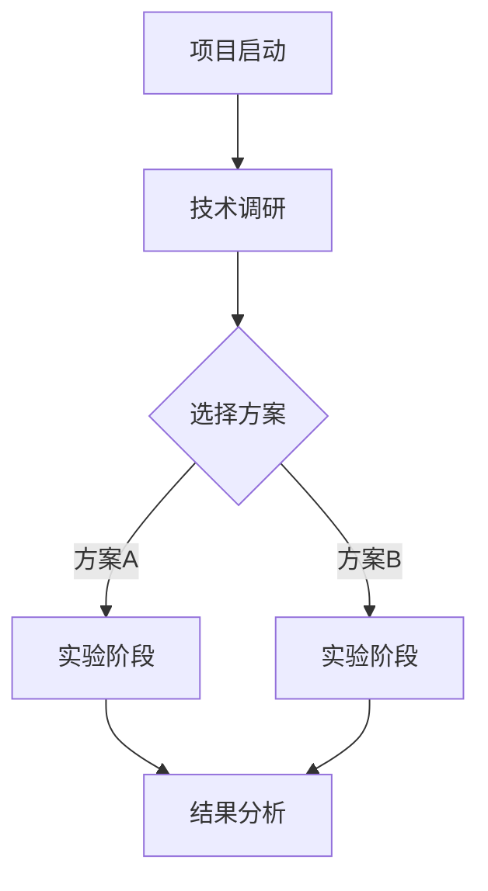

# Research Memory Management System

A comprehensive system for tracking research projects with automatic memory capture, structured organization, and progressive disclosure.

## Core Philosophy

**Memory Like Humans**: Record key conclusions and indicators, not complete logs. Capture everything in the moment (even fleeting ideas), but organize for efficient retrieval.

**Progressive Disclosure**: Each memory file starts with topic + brief description. Agent reads description first, loads full content only if relevant to current task.

**Automatic Capture**: Agent detects and records research activities automatically during conversation, minimizing user burden.

**Source File Tracking**: Results and resources can link to original data files (CSVs, images, PDFs, etc.) for full traceability. Files are verified lazily (only when accessed) and can be relocated if moved.

**Session Capture**: Can retroactively capture research activities from current conversation session, useful when user starts using the skill mid-project.

## When to Use This Skill

Use this skill whenever:
- User is working on a research project with evolving technical decisions
- Conversation involves ideas, experiments, results, or technical choices
- User mentions decisions, proposals, findings, or resources
- User explicitly calls `/research-memory` commands

**Trigger aggressively** - it's better to over-record than miss important information. The progressive disclosure system ensures irrelevant memories don't clutter context.

## Directory Structure

When initializing or working with a research project, create this structure under `memory/{project_name}/`:

```
memory/
└── {project_name}/
    ├── project_root.md         # Project overview and root node
    ├── outline.md              # Research lifecycle and technical roadmap
    ├── ideas/
    │   ├── register.md         # Index of all ideas
    │   └── idea_*.md           # Individual idea records
    ├── experiments/
    │   ├── register.md         # Index of all experiments
    │   └── exp_*.md            # Individual experiment records
    ├── results/
    │   ├── register.md         # Index of all results
    │   └── result_*.md         # Individual result records
    ├── decisions/
    │   ├── register.md         # Index of all decisions
    │   └── decision_*.md       # Individual decision records
    └── resources/
        ├── register.md         # Index of all resources
        ├── papers/             # Reference papers
        ├── repos/              # Code repositories
        └── datasets/           # Dataset information
```

## Automatic Detection and Recording

### Detection Patterns

Monitor conversation for these signals and **automatically record** without asking for confirmation:

#### 1. Decision Signals
- "I decide to...", "we'll use...", "let's go with...", "I choose..."
- "switching to...", "adopting...", "changing from X to Y"
- "final decision is...", "we're going with..."

**Action**: Record to `decisions/`, update `outline.md`, link related ideas/experiments

#### 2. Idea Signals
- "what if we...", "maybe we could...", "I'm thinking...", "how about..."
- "an idea: ...", "could we try...", "perhaps..."
- Any speculative or exploratory statement

**Action**: Record to `ideas/`, update register, suggest experiment design if appropriate

#### 3. Experiment Signals
- "I'm going to test...", "let's try...", "running experiment..."
- "testing with...", "validating...", "benchmarking..."
- User provides experiment parameters, datasets, model configs

**Action**: Record to `experiments/`, link to related idea, capture configuration

#### 4. Result Signals
- "accuracy is...", "the result shows...", "we found...", "it achieved..."
- "performance: ...", "metrics: ...", "conclusion: ..."
- Any quantitative or qualitative findings
- File path mentions: "results saved in...", "output at...", "data in..."

**Action**: Record to `results/`, **MUST link to the specific experiment that produced this result**, extract key metrics, **capture source file paths if mentioned**

**CRITICAL**: When recording results, ALWAYS identify which experiment produced them. If unclear, ask user: "Which experiment produced this result?" Never record orphaned results without experiment linkage.

**Source File Tracking**: If user mentions where result files are saved, automatically record in `source_files` field. If not mentioned, **ask user**: "Where are the detailed result files saved? (optional, provide path or 'skip')"

#### 5. Resource Signals
- User shares paper links, GitHub repos, dataset URLs
- "according to this paper...", "I found this code...", "using dataset X"
- References to external materials
- File path mentions: "paper at...", "downloaded to...", "saved in..."

**Action**: Record to `resources/`, extract metadata, link to related memories, **capture source file paths if mentioned**

**Source File Tracking**: If user provides local file paths (PDFs, datasets, etc.), automatically record in `source_files` field.

### Context Awareness

Understand conversation context to determine if this is:
- **New memory**: Create new file with auto-incremented ID and descriptive name
- **Update to existing**: Append to most recent related memory
- **Refinement of decision**: Update the decision file with additional details

**CRITICAL - Idea-Experiment-Result Chain**:
- Every experiment MUST link to the idea it validates
- Every result MUST link to the experiment that produced it
- Maintain clear traceability: idea → experiment → result

**Example flow:**
```
User: "I want to use Transformer"
→ Detect: New idea
→ Create: ideas/idea_transformer_003.md
→ Notify: "💡 Recorded: Transformer architecture idea (idea_transformer_003)"

User: "Specifically, I'll use BERT pretrained"
→ Detect: Refinement of idea_transformer_003
→ Update: ideas/idea_transformer_003.md with BERT details
→ Notify: "📝 Updated: idea_transformer_003 with BERT specifics"

User: "I'm running an experiment with BERT on dataset X"
→ Detect: New experiment related to idea_transformer_003
→ Create: experiments/exp_bert_pdbbind_005.md, link to idea_transformer_003
→ Notify: "🧪 Recorded: BERT on dataset X experiment (exp_bert_pdbbind_005)"

User: "Accuracy reached 85%"
→ Detect: Result for exp_bert_pdbbind_005
→ Create: results/result_bert_85acc_005.md, link to exp_bert_pdbbind_005
→ Notify: "📊 Recorded: 85% accuracy result (result_bert_85acc_005)"
```

### Notification Format

After recording, provide **brief but informative** notification:

**Format**: `[Icon] [Action]: [Brief description] ([filename])`

**Examples:**
- `💡 Recorded: Transformer architecture idea (idea_transformer_003)`
- `🧪 Recorded: BERT on PDBbind experiment (exp_bert_pdbbind_005)`
- `📊 Recorded: 85% accuracy result (result_bert_85acc_005)`
- `✅ Recorded: Decision to use PyTorch (decision_pytorch_002)`
- `📚 Recorded: Attention paper reference (resource_attention_paper_007)`
- `📝 Updated: idea_transformer_003 with implementation details`

**Icons:**
- 💡 Ideas
- 🧪 Experiments
- 📊 Results
- ✅ Decisions
- 📚 Resources
- 📝 Updates

Keep notifications to one line. Don't interrupt conversation flow.

## File Templates

### project_root.md

```markdown
---
created: YYYY-MM-DD
last_updated: YYYY-MM-DD
status: active | completed | paused
---

# Project: {项目名称}

## 总体目标
[一句话描述项目的核心目标]

## 详细描述
[2-3段描述项目背景、动机、预期成果]

## 关键问题
- 问题1
- 问题2

## 当前状态
**阶段**: [当前研究阶段]
**进度**: [简要进展描述]
**下一步**: [下一步计划]

## 快速导航
- 技术路线: [outline.md](outline.md)
- 想法索引: [ideas/register.md](ideas/register.md)
- 实验索引: [experiments/register.md](experiments/register.md)
- 结果索引: [results/register.md](results/register.md)
- 决策索引: [decisions/register.md](decisions/register.md)
```

### register.md (for each subdirectory)

```markdown
# {子目录名称} Register

## 最近更新
- **最新**: [001] Transformer for 3D structures - Use attention for spatial relationships (2024-03-10)
- **关键**: [003] BERT pretrained model - Leverage language model for proteins (2024-03-12)

## 完整索引

| ID | 文件名 | 主题 | 一句话描述 | 日期 | 状态 |
|----|--------|------|-----------|------|------|
| 001 | idea_transformer_3d_001.md | Transformer for 3D | Use attention for spatial relationships | 2024-03-10 | 已验证 |
| 002 | idea_data_augmentation_002.md | 数据增强 | Synthetic pocket generation | 2024-03-12 | 进行中 |
| 003 | idea_bert_pretrain_003.md | BERT预训练 | Leverage language model for proteins | 2024-03-15 | 已验证 |

## 统计
- 总数: 3
- 进行中: 1
- 已完成: 2
- 已放弃: 0
```

### Memory File Template (idea/experiment/result/decision)

```markdown
---
id: {auto_incremented_id}
type: idea | experiment | result | decision | resource
created: YYYY-MM-DD HH:MM
last_updated: YYYY-MM-DD HH:MM
tags: [tag1, tag2, tag3]
related: [exp_001, result_001]  # Related memory IDs
status: proposed | in-progress | validated | completed | abandoned
source_files:  # Optional: for results and resources
  - path: /absolute/or/relative/path/to/file.csv
    type: csv | json | png | pdf | txt | etc
    description: Brief description of what this file contains
    last_verified: YYYY-MM-DD HH:MM
---

# {主题}

## 简要描述
[一句话或一段话的核心描述 - Agent先读这部分判断相关性]

---

## 详细内容

### [根据类型调整以下sections]

#### For Ideas:
- **动机**: 为什么产生这个想法
- **核心思路**: 详细技术方案
- **预期优势**: 列出优势
- **潜在风险**: 列出风险
- **后续行动**: 待办事项

#### For Experiments:
- **目标**: 实验要验证什么
- **方法**: 实验设计和步骤
- **配置**: 参数、数据集、环境
- **预期结果**: 期望看到什么
- **实际执行**: 执行记录

#### For Results:
- **关键指标**: 核心数值结果
- **关键发现**: 主要结论
- **意外发现**: 未预期的观察
- **下一步**: 基于结果的建议
- **原始数据**: 如果有source_files，说明详细数据位置

#### For Decisions:
- **决策点**: 需要决定什么
- **选项**: 可选方案列表
- **选择**: 最终选择
- **理由**: 为什么这样选择
- **影响**: 这个决策的影响范围

#### For Resources:
- **资源类型**: Paper | Code | Dataset | Documentation
- **来源**: URL或文件路径
- **关键信息**: 标题、作者、年份等元信息
- **主要内容**: 简要总结
- **相关性**: 与项目的关系

### 相关资源
- 参考: [链接到相关记忆或外部资源]

### 更新历史
- YYYY-MM-DD: [更新内容]
```

### outline.md

```markdown
# Research Outline: {项目名称}

## 研究时间线



## 技术路线决策树

### 阶段 1: {阶段名称} ({开始日期} - {结束日期})

**决策点**: {需要决定什么}

**选项**:
- 选项A: {描述}
- 选项B: {描述}

**选择**: {最终选择}

**理由**: [链接到 decisions/decision_XXX.md]

**相关记忆**:
- 想法: [ideas/idea_XXX.md]
- 实验: [experiments/exp_XXX.md]
- 结果: [results/result_XXX.md]

---

### 阶段 2: {下一阶段}
...

## 关键里程碑

- [x] YYYY-MM-DD: {里程碑1}
- [x] YYYY-MM-DD: {里程碑2}
- [ ] YYYY-MM-DD: {未来里程碑}

## 当前状态
**阶段**: {当前阶段名称}
**进度**: {百分比或描述}
**下一步**: {下一步行动}
**阻塞**: {如果有阻塞因素}
```

## Commands

### Initialization

**`/research-memory init "{project_name}" "{overall_goal}"`**

Initialize a new research project.

**Actions:**
1. Create directory structure under `memory/{project_name}/`
2. Create `project_root.md` with goal
3. Create `outline.md` with initial structure
4. Create all subdirectories with empty `register.md` files
5. Set project as active

**Example:**
```
/research-memory init "protein-pocket-detection" "Develop deep learning model for protein binding pocket identification"
```

### Manual Recording

**`/research-memory add-idea "{topic}" "{description}"`**

Manually record an idea.

**`/research-memory add-experiment "{name}" "{description}"`**

Manually record an experiment.

**`/research-memory add-result "{topic}" "{key_findings}" [--source "{file_path}"]`**

Manually record a result. Optionally specify source file path.

**Example:**
```
/research-memory add-result "85% accuracy on BERT" "Outperforms baseline" --source "./results/exp_001.csv"
```

**`/research-memory add-decision "{decision_point}" "{choice}" "{rationale}"`**

Manually record a decision.

**`/research-memory add-resource "{type}" "{path_or_url}" "{description}"`**

Manually record a resource (paper/repo/dataset).

### Session Capture

**`/research-memory capture-session ["{project_name}"]`**

Retroactively capture research activities from current conversation session.

**Use case**: User has been discussing research for a while, then decides to start using research-memory.

**Process:**
1. If project_name not provided and no active project, prompt for project name
2. If project doesn't exist, initialize it first
3. Analyze entire current session conversation history
4. Extract:
   - Ideas discussed
   - Experiments mentioned
   - Results reported
   - Decisions made
   - Resources referenced
5. Reconstruct timeline and relationships
6. Generate all memory files with proper linkage
7. Display summary of captured memories
8. Ask user for confirmation or adjustments

**Example:**
```
/research-memory capture-session "protein-pocket-detection"

→ Analyzing current session...
→ Found:
  - 3 ideas (Transformer architecture, data augmentation, BERT pretrain)
  - 2 experiments (BERT on PDBbind, CNN baseline)
  - 2 results (85% accuracy, 78% baseline)
  - 1 decision (Use PyTorch framework)

→ Creating memory structure...
→ ✅ Created 8 memory files with proper linkage

📋 Summary:
Ideas:
- idea_transformer_3d_001: Transformer for 3D protein structures
- idea_data_augmentation_002: Synthetic pocket generation
- idea_bert_pretrain_003: Leverage language model

Experiments:
- exp_bert_pdbbind_001: BERT on PDBbind dataset
- exp_cnn_baseline_002: CNN baseline comparison

Results:
- result_bert_85acc_001: 85% accuracy (from exp_bert_pdbbind_001)
- result_cnn_78acc_002: 78% baseline (from exp_cnn_baseline_002)

Decisions:
- decision_pytorch_framework_001: Use PyTorch for better 3D ops

Review and adjust? [continue/edit]
```

### Conversational Recording

**Trigger phrases:**
- "Help me record..." / "帮我记录..."
- "Help me summarize... and record" / "帮我总结...并记录"
- "Add... to research-memory" / "把...记录到research-memory"

**Examples:**

**Record an idea:**
```
User: "帮我记录一个想法：使用GNN处理蛋白质结构"
Agent: 💡 Recorded: GNN for protein structures (idea_gnn_protein_004)
```

**Summarize and record a paper:**
```
User: "帮我总结这篇论文并记录到resources"
User: [provides paper link or content]

Agent:
[Reads and summarizes paper]

📚 Recorded: Attention Is All You Need paper (resource_attention_paper_005)

Summary:
- Authors: Vaswani et al., 2017
- Key contribution: Transformer architecture with self-attention
- Relevance: Foundation for our protein structure modeling approach
- Source: https://arxiv.org/abs/1706.03762
```

**Record experiment with results:**
```
User: "帮我记录昨天的实验：在PDBbind上测试了BERT，准确率85%，结果保存在 ./results/bert_exp.csv"

Agent:
🧪 Recorded: BERT on PDBbind experiment (exp_bert_pdbbind_006)
📊 Recorded: 85% accuracy result (result_bert_85acc_006)
📁 Source: ./results/bert_exp.csv

Which idea does this experiment validate? (or 'exploratory' if none)
```

**Record a decision:**
```
User: "帮我记录一个决策：我们决定不用CNN，改用Transformer，因为它能更好地捕获长距离依赖"

Agent:
✅ Recorded: Switch to Transformer architecture (decision_use_transformer_005)
📝 Updated: outline.md with new decision point
```

### Context Loading

**`/research-memory load "{project_name}"`**

Load project context for current session.

**Process:**
1. Read `project_root.md` → understand overall goal
2. Read `outline.md` → understand technical roadmap and current stage
3. Read all `register.md` files → browse one-line descriptions
4. Based on current task, determine which memories are relevant
5. Load only relevant memory files' full content
6. Report loaded context to user

**Example output:**
```
📂 Loaded project: protein-pocket-detection

🎯 Goal: Develop deep learning model for protein binding pocket identification
📍 Current stage: Phase 2 - Model architecture selection
🔄 Progress: 60% - Evaluating Transformer vs CNN approaches

📋 Available memories:
- 5 ideas (2 active)
- 3 experiments (1 running)
- 2 results
- 4 decisions

💡 Relevant to current task:
- idea_transformer_3d_003: Transformer architecture for 3D protein structures
  → validated by: exp_transformer_pdbbind_002
    → produced: result_transformer_85acc_002
- decision_graph_neural_net_002: Decision to use graph neural networks

Ready to continue research!
```

### Memory Review

**`/research-memory recent [1h|2h|6h|1d|3d|7d]`**

Show recently added memories (default: 1h).

**Output format** (register-style, no full content):
```
📝 Recent memories (last 2h):

Ideas:
- [003] idea_transformer_3d_003.md - Transformer for 3D structures: Use attention for spatial relationships (14:23)
- [004] idea_data_augmentation_004.md - Data augmentation strategy: Synthetic pocket generation (15:10)

Experiments:
- [005] exp_bert_pdbbind_005.md - BERT on PDBbind: Testing pretrained model (14:45)
  → validates: idea_transformer_3d_003

Results:
- [005] result_bert_85acc_005.md - 85% accuracy achieved: Outperforms baseline CNN (15:30)
  → from experiment: exp_bert_pdbbind_005

Decisions:
- [003] decision_pytorch_framework_003.md - Use PyTorch framework: Better 3D ops support (14:50)
```

**`/research-memory undo {memory_id}`**

Remove a memory record (for handling misdetections).

**Example:**
```
/research-memory undo idea_data_augmentation_004
→ Removed idea_data_augmentation_004 from ideas/ and updated register
```

### Search and Query

**`/research-memory search "{keywords}"`**

Search across all memories.

**Returns:**
- Matching memory IDs and brief descriptions
- Relevance score
- Option to load full content

**`/research-memory show {memory_id}`**

Display full content of a specific memory.

**`/research-memory list [ideas|experiments|results|decisions|resources]`**

List all memories of a specific type (shows register).

### Updates

**`/research-memory update {memory_id} "{new_content}"`**

Update an existing memory.

**`/research-memory link {memory_id_1} {memory_id_2}`**

Manually create a link between two memories.

**`/research-memory status {memory_id} {new_status}`**

Update memory status (proposed/in-progress/completed/abandoned).

### Source File Management

**`/research-memory add-source {memory_id} "{file_path}" ["{description}"]`**

Add a source file to an existing result or resource memory.

**Example:**
```
/research-memory add-source result_bert_85acc_005 "./results/bert_output.csv" "Raw experiment metrics"

→ 📁 Added source file to result_bert_85acc_005
```

**`/research-memory verify-sources {memory_id}`**

Verify all source files for a specific memory exist and are accessible.

**Process:**
1. Read memory file and extract all source_files
2. Check each file path exists
3. For missing files:
   - Search project directory for same filename
   - Present possible matches to user
   - Ask user to select or provide new path
4. Update last_verified timestamp for found files
5. Update paths for relocated files

**Example:**
```
/research-memory verify-sources result_bert_85acc_005

→ Verifying source files for result_bert_85acc_005...

✅ ./results/bert_output.csv (verified)
❌ ./results/bert_plots.png (not found)

Searching for bert_plots.png in project directory...
Found possible matches:
1. ./new_results/bert_plots.png (modified: 2024-03-10 16:30)
2. ./backup/bert_plots.png (modified: 2024-03-09 10:15)

Select new location (1-2) or provide path (or 'skip'):
```

**`/research-memory update-source {memory_id} "{old_path}" "{new_path}"`**

Update a source file path (for manually relocating files).

**Example:**
```
/research-memory update-source result_bert_85acc_005 \
  "./results/bert_output.csv" \
  "./new_results/bert_output.csv"

→ 📁 Updated source file path in result_bert_85acc_005
```

**`/research-memory show-sources {memory_id}`**

Display all source files for a memory with their status.

**Example:**
```
/research-memory show-sources result_bert_85acc_005

📁 Source files for result_bert_85acc_005:

1. ./results/bert_output.csv
   Type: csv
   Description: Raw experiment metrics
   Last verified: 2024-03-10 15:30
   Status: ✅ Exists

2. ./results/bert_plots.png
   Type: image
   Description: Accuracy curves and confusion matrix
   Last verified: 2024-03-10 15:30
   Status: ❌ Not found
```

### Reporting

**`/research-memory report [summary|detailed|timeline]`**

Generate project report.

**Summary**: High-level overview with key metrics
**Detailed**: Full report with all memories organized by type
**Timeline**: Chronological view of research progression

**`/research-memory export "{output_path}"`**

Export entire memory structure to a specified directory.

## Progressive Disclosure Implementation

### Loading Strategy

When loading project context:

1. **Always load** (small, essential):
   - `project_root.md`
   - `outline.md`
   - All `register.md` files

2. **Conditionally load** (based on relevance):
   - Read brief descriptions from registers
   - Match against current task keywords
   - Load full content only for relevant memories

3. **On-demand load** (when explicitly needed):
   - User asks about specific memory
   - User searches for information
   - Agent needs to verify details

### Relevance Scoring

Score each memory's relevance to current task:

```python
relevance_score = (
    keyword_match_score * 0.4 +
    recency_score * 0.2 +
    status_score * 0.2 +  # in-progress > completed > abandoned
    connection_score * 0.2  # linked to already-loaded memories
)
```

Load memories with score > 0.6.

### Memory Budget

To prevent context overflow:
- No strict limit on number of full memory files loaded (load as many as relevant)
- Prioritize by relevance score
- Always keep project_root and outline loaded

**CRITICAL - Document Organization**:
- Each memory file contains ONLY ONE idea/experiment/result
- Don't mix unrelated content in the same file
- Organize by idea: related experiments and results are linked via YAML frontmatter, not merged into one file
- Example structure:
  ```
  idea_transformer_001.md (one idea)
    ↓ related: [exp_transformer_pdbbind_005]
  exp_transformer_pdbbind_005.md (one experiment validating idea_transformer_001)
    ↓ related: [result_transformer_85acc_005]
  result_transformer_85acc_005.md (one result from exp_transformer_pdbbind_005)
  ```
- BAD: Putting multiple unrelated experiments in one file
- GOOD: One file per experiment, linked via `related` field

## Automatic Relationship Building

### Link Detection

Automatically create links between memories when:
- Experiment references an idea
- Result references an experiment
- Decision references ideas/experiments
- Resource is cited in idea/experiment

### Link Types

- `validates`: Experiment validates idea
- `implements`: Experiment implements idea
- `produces`: Experiment produces result
- `supports`: Resource supports idea/experiment
- `leads_to`: Decision leads to experiment
- `refines`: New idea refines previous idea

### Relationship Graph

Maintain implicit graph structure:
```
idea_transformer_3d_003 (Transformer for 3D structures)
  ├─ validates → exp_bert_pdbbind_005 (BERT experiment)
  │   └─ produces → result_bert_85acc_005 (85% accuracy)
  └─ leads_to → decision_pytorch_framework_003 (Use PyTorch)
```

**Traceability Chain Example**:
```
idea_transformer_3d_003.md
  related: [exp_bert_pdbbind_005, decision_pytorch_framework_003]

exp_bert_pdbbind_005.md
  related: [idea_transformer_3d_003, result_bert_85acc_005]

result_bert_85acc_005.md
  related: [exp_bert_pdbbind_005]

decision_pytorch_framework_003.md
  related: [idea_transformer_3d_003]
```

## Best Practices

### For Agent

1. **Be aggressive in detection**: When in doubt, record it. Better to have too much than miss important information.

2. **Keep notifications brief**: One line per record. Don't break conversation flow.

3. **Understand context**: Distinguish between new memories and updates to existing ones.

4. **Extract key information**: When recording, pull out the essential details (metrics, decisions, rationale).

5. **Maintain connections**: Always link related memories (experiment to idea, result to experiment).

6. **Update outline**: When recording decisions, update the technical roadmap in outline.md.

7. **Progressive disclosure**: When loading context, start with registers, load full content only when relevant.

8. **CRITICAL - Organize by idea**: Each memory file should focus on ONE idea/experiment/result. Don't mix unrelated experiments in the same file. Keep clear separation:
   - One idea per idea file
   - One experiment per experiment file (linked to its idea)
   - One result per result file (linked to its experiment)
   - Related memories are connected via `related` field in YAML frontmatter, NOT by mixing content

9. **CRITICAL - Maintain traceability**: Every experiment must trace back to an idea. Every result must trace back to an experiment. If user reports results without mentioning experiment, ask: "Which experiment produced this result?"

10. **Descriptive file naming**: Always include 2-4 keywords in filename that describe the content (e.g., `idea_transformer_3d_protein_001.md`, not `idea_001.md`).

11. **Source file tracking**: When recording results or resources:
    - Automatically detect file path mentions in user messages
    - If user mentions result files, capture paths in `source_files` field
    - If not mentioned, **ask user**: "Where are the detailed result files saved? (optional, provide path or 'skip')"
    - Record file type, description, and timestamp
    - Verify files **only when accessed**, not proactively

12. **Lazy verification**: Don't verify source file existence unless:
    - User explicitly requests to view the file
    - User runs `/research-memory show {memory_id}` with source files
    - User runs `/research-memory verify-sources {memory_id}`
    - Never proactively scan directories to check file existence

13. **Missing file recovery**: When source file not found:
    - Search project directory for same filename using Glob tool
    - Present top 5 matches sorted by modification time
    - Ask user to select correct file or provide new path
    - Update memory file with new path and timestamp
    - If user skips, note in memory that file is missing

### For Users

1. **Trust the system**: Let agent record automatically. Review with `/research-memory recent` if concerned.

2. **Use undo sparingly**: Only remove obvious mistakes. Even abandoned ideas have value.

3. **Explicit commands for important items**: Use manual commands for critical decisions you want to ensure are captured.

4. **Regular reviews**: Periodically check `/research-memory report summary` to see research progress.

5. **Provide file paths**: When reporting results, mention where files are saved to enable full traceability.

## Source File Tracking and Traceability

### Purpose

Research memories record **key conclusions and indicators** (human-like memory), not complete raw data. Source file tracking provides traceability to original data files for:
- Detailed experiment outputs (CSVs, JSON, logs)
- Visualization plots (PNG, PDF)
- Raw datasets
- Paper PDFs
- Code repositories

### Automatic Detection

Agent automatically detects file path mentions:

**Trigger phrases:**
- "results saved in...", "output at...", "data in..."
- "file is at...", "saved to...", "downloaded to..."
- Any absolute or relative file path in conversation

**Example:**
```
User: "实验结果保存在 ./results/exp_001_output.csv，准确率85%"

Agent:
→ Detects: Result + file path
→ Creates: result_bert_85acc_005.md
→ Records in YAML frontmatter:
   source_files:
     - path: ./results/exp_001_output.csv
       type: csv
       description: Raw experiment output with all metrics
       last_verified: 2024-03-10 15:30
→ Notifies: "📊 Recorded: 85% accuracy result (result_bert_85acc_005)
            📁 Source: ./results/exp_001_output.csv"
```

### Proactive Asking

If user reports results without mentioning file location, agent **asks**:

```
User: "实验跑完了，准确率85%"

Agent: "📊 Recorded: 85% accuracy result (result_bert_85acc_005)

       Where are the detailed result files saved? (optional, provide path or 'skip')"

User: "./results/exp_001.csv"

Agent: "📁 Updated: Added source file to result_bert_85acc_005"
```

### Lazy Verification

**Philosophy**: Only verify file existence when actually needed, not proactively.

**Verification triggers:**
1. User explicitly requests: "Show me the detailed results for result_bert_85acc_005"
2. User runs: `/research-memory show result_bert_85acc_005`
3. User runs: `/research-memory verify-sources result_bert_85acc_005`
4. Agent needs to access file content for analysis

**Never verify:**
- During initial recording
- During session load
- Periodically in background
- When listing memories

### Missing File Recovery

When file not found during verification:

**Step 1: Search project directory**
```python
# Use Glob tool to search
filename = basename(missing_path)
matches = glob_search(f"**/{filename}", project_root)
matches.sort(by=modification_time, reverse=True)
top_matches = matches[:5]
```

**Step 2: Present options to user**
```
❌ ./results/exp_001_output.csv (not found)

Searching for exp_001_output.csv in project directory...
Found possible matches:
1. ./new_results/exp_001_output.csv (modified: 2024-03-10 16:30)
2. ./backup/results/exp_001_output.csv (modified: 2024-03-09 10:15)
3. ./archive/exp_001_output.csv (modified: 2024-03-08 14:20)

Select new location (1-3), provide path, or 'skip':
```

**Step 3: Update memory**
```
User: "1"

Agent:
→ Updates result_bert_85acc_005.md
→ Changes path to ./new_results/exp_001_output.csv
→ Updates last_verified timestamp
→ Notifies: "📁 Updated: result_bert_85acc_005 source file path"
```

### Source File Structure

In memory YAML frontmatter:

```yaml
source_files:
  - path: ./results/exp_001_output.csv
    type: csv
    description: Raw experiment metrics (accuracy, precision, recall, F1)
    last_verified: 2024-03-10 15:30
  - path: ./results/exp_001_plots.png
    type: image
    description: Accuracy curves and confusion matrix visualization
    last_verified: 2024-03-10 15:30
  - path: ./results/exp_001_config.json
    type: json
    description: Experiment hyperparameters and configuration
    last_verified: 2024-03-10 15:30
```

**Fields:**
- `path`: Absolute or relative file path (relative to project root)
- `type`: File extension (csv, json, png, pdf, txt, etc.)
- `description`: Brief description of file contents
- `last_verified`: Timestamp of last successful access

### Multiple Files

Results and resources can have multiple source files:

**Example - Experiment result with multiple outputs:**
```yaml
source_files:
  - path: ./results/exp_001_metrics.csv
    type: csv
    description: Numerical metrics
  - path: ./results/exp_001_predictions.json
    type: json
    description: Model predictions on test set
  - path: ./results/exp_001_confusion_matrix.png
    type: image
    description: Confusion matrix visualization
  - path: ./results/exp_001_roc_curve.png
    type: image
    description: ROC curve and AUC score
```

### Resource Files

For resources (papers, datasets, code):

**Paper example:**
```yaml
source_files:
  - path: ~/Downloads/attention_is_all_you_need.pdf
    type: pdf
    description: Original Transformer paper (Vaswani et al., 2017)
    last_verified: 2024-03-10 10:00
```

**Dataset example:**
```yaml
source_files:
  - path: ./data/pdbbind_v2020.tar.gz
    type: archive
    description: PDBbind dataset v2020 (compressed)
    last_verified: 2024-03-10 09:00
  - path: ./data/pdbbind_v2020/
    type: directory
    description: Extracted PDBbind dataset
    last_verified: 2024-03-10 09:15
```

### Best Practices

**For Agent:**
1. Always detect file path mentions in user messages
2. Ask for file paths when recording results if not provided
3. Record multiple files if user mentions them
4. Use relative paths when possible (relative to project root)
5. Only verify when actually accessing files
6. Search intelligently when files missing (project directory only)
7. Update timestamps after successful verification

**For Users:**
1. Mention file paths when reporting results
2. Use consistent directory structure for results
3. Don't move files frequently; if you do, use `/research-memory update-source`
4. Provide descriptive filenames that match memory topics
5. Keep result files in project directory for easier recovery

### Example Workflow

**Complete result recording with source files:**

```
1. User: "BERT实验完成，准确率85%，结果在 ./results/bert_exp_001/"

2. Agent:
   → Detects: Result + directory path
   → Asks: "Found directory ./results/bert_exp_001/. Which files should I track?
           (e.g., 'metrics.csv, plots.png' or 'all *.csv and *.png')"

3. User: "metrics.csv, confusion_matrix.png, roc_curve.png"

4. Agent:
   → Creates: result_bert_85acc_005.md
   → Records:
     source_files:
       - path: ./results/bert_exp_001/metrics.csv
         type: csv
         description: Experiment metrics
       - path: ./results/bert_exp_001/confusion_matrix.png
         type: image
         description: Confusion matrix
       - path: ./results/bert_exp_001/roc_curve.png
         type: image
         description: ROC curve
   → Notifies: "📊 Recorded: 85% accuracy result (result_bert_85acc_005)
               📁 Sources: 3 files tracked"

5. [Later session]

6. User: "Show me the detailed results for result_bert_85acc_005"

7. Agent:
   → Reads: result_bert_85acc_005.md
   → Verifies: All 3 source files
   → All exist ✅
   → Displays: Key metrics from memory + offers to show file contents
   → Updates: last_verified timestamps

8. User: "Show me the confusion matrix"

9. Agent:
   → Reads: ./results/bert_exp_001/confusion_matrix.png
   → Displays: Image inline
```

## Error Handling

### Misdetection

If agent records something incorrectly:
```
User: "That was just a random thought, not a real idea"
Agent: "Got it. Removing idea_007."
→ Execute: /research-memory undo idea_007
```

### Duplicate Detection

Before creating new memory, check if similar memory exists:
- Search by keywords in topic
- Check recent memories (last 1 hour)
- If found, ask: "This seems related to idea_003. Update that instead?"

### Missing Information

If recording lacks key details:
```
Agent: "🧪 Recorded: New experiment (exp_006)"
Agent: "Which idea does this experiment validate? (or 'none' if exploratory)"
```

## Integration with Research Workflow

### Typical Research Session

```
1. User: /research-memory load "my-project"
   → Agent loads context

2. User: "I'm thinking we should try a different architecture"
   → Agent detects idea signal
   → Records to ideas/
   → Notifies: "💡 Recorded: Alternative architecture idea (idea_new_architecture_008)"

3. User: "Let's test it with dataset X"
   → Agent detects experiment signal
   → Records to experiments/, links to idea_new_architecture_008
   → Notifies: "🧪 Recorded: Architecture test on dataset X (exp_new_arch_datasetx_009)"

4. [User runs experiment]

5. User: "Results show 90% accuracy, better than baseline"
   → Agent detects result signal
   → Records to results/, links to exp_new_arch_datasetx_009
   → Notifies: "📊 Recorded: 90% accuracy result (result_new_arch_90acc_009)"

6. User: "Based on this, I decide to adopt the new architecture"
   → Agent detects decision signal
   → Records to decisions/, links idea_new_architecture_008, exp_new_arch_datasetx_009, result_new_arch_90acc_009
   → Updates outline.md with decision
   → Notifies: "✅ Recorded: Architecture adoption decision (decision_adopt_new_arch_004)"

7. User: /research-memory report summary
   → Agent generates progress report showing complete chain:
     idea_new_architecture_008 → exp_new_arch_datasetx_009 → result_new_arch_90acc_009 → decision_adopt_new_arch_004
```

### Cross-Session Continuity

When starting a new session:
```
User: "Continue working on protein pocket detection"
Agent: [Automatically triggers research-memory load]
Agent: "📂 Resuming project: protein-pocket-detection
       📍 Last session: 2 days ago
       🔄 Recent progress:
       - Completed BERT experiment (exp_005)
       - Achieved 85% accuracy (result_005)
       - Decided to use PyTorch (decision_003)

       💡 Next steps from outline:
       - Implement full training pipeline
       - Test on larger dataset

       Ready to continue!"
```

## Advanced Features

### Automatic Milestone Detection

Detect and record milestones:
- First successful experiment
- Accuracy threshold reached
- Major technical decision made
- Paper/code published

Add to outline.md automatically.

### Experiment Tracking

For experiments, automatically track:
- Configuration (hyperparameters, dataset, model)
- Start time
- Expected completion
- Status updates
- Final results

### Resource Metadata Extraction

When user shares resources, automatically extract:
- **Papers**: Title, authors, year, venue, key contributions
- **Repos**: Name, stars, language, description
- **Datasets**: Name, size, domain, license

### Smart Suggestions

Based on memory patterns, suggest:
- "You have 3 ideas without experiments. Want to design validation tests?"
- "Experiment exp_005 has been running for 2 days without results. Check status?"
- "Decision decision_003 has no follow-up experiments. Next steps?"

## File Naming Conventions

**CRITICAL**: File names MUST include descriptive keywords that reflect content, not just sequential IDs.

**Format**: `{type}_{descriptive_keywords}_{id}.md`

**Examples:**
- Ideas: `idea_transformer_001.md`, `idea_data_augmentation_002.md`, `idea_graph_neural_net_003.md`
- Experiments: `exp_bert_pdbbind_001.md`, `exp_cnn_baseline_002.md`, `exp_transformer_large_003.md`
- Results: `result_bert_85acc_001.md`, `result_cnn_baseline_78acc_002.md`, `result_transformer_90acc_003.md`
- Decisions: `decision_pytorch_framework_001.md`, `decision_use_pretrain_002.md`, `decision_architecture_003.md`
- Resources: `resource_attention_paper_001.md`, `resource_pdbbind_dataset_002.md`, `resource_bert_repo_003.md`

**Naming Guidelines:**
- Use 2-4 descriptive keywords (lowercase, underscore-separated)
- Keywords should capture the essence of the content
- ID is still auto-incremented (001, 002, ..., 999)
- Keep total filename under 50 characters

**Bad examples** (too generic):
- ❌ `idea_001.md`, `exp_005.md`, `result_003.md`

**Good examples** (descriptive):
- ✅ `idea_transformer_3d_protein_001.md`
- ✅ `exp_bert_pretrain_pdbbind_005.md`
- ✅ `result_transformer_90acc_outperform_003.md`

## Summary

This skill provides a comprehensive research memory system that:
- ✅ Automatically captures research activities during conversation
- ✅ Organizes memories in a structured, navigable tree
- ✅ Uses progressive disclosure to manage context efficiently
- ✅ Maintains technical roadmap and decision history
- ✅ Supports both automatic and manual recording
- ✅ Enables cross-session continuity
- ✅ Provides tools for review, search, and reporting
- ✅ **Session capture**: Retroactively build memory from current conversation
- ✅ **Conversational recording**: "Help me record..." / "帮我总结...并记录"
- ✅ **Source file tracking**: Full traceability to original data files
- ✅ **Lazy verification**: Only verify files when accessed, smart recovery when missing

The system is designed to be **aggressive in capture** but **smart in retrieval**, ensuring nothing important is lost while keeping context manageable. Source file tracking provides complete traceability from high-level conclusions to raw data.
